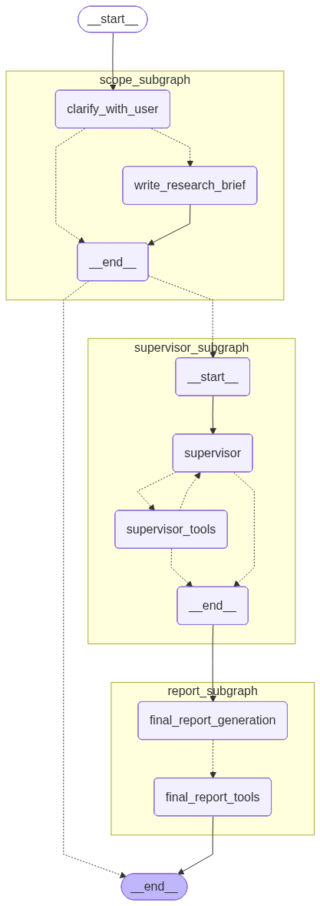

# Local Research Agent

A LangGraph-based research agent that conducts comprehensive research and generates detailed reports.

## Architecture



## Quick Start

Run the development server:

```bash
uvx --refresh --from "langgraph-cli[inmem]" --with-editable . --python 3.11 langgraph dev --allow-blocking
```

## Model Configuration

Configure different models for different research tasks using environment variables. Copy `.env.example` to `.env` and configure your models:

```bash
cp .env.example .env
```

### Supported Providers

- **OpenAI**: `openai:gpt-4o`, `openai:gpt-4o-mini`
- **Anthropic**: `anthropic:claude-3-5-sonnet-20241022`, `anthropic:claude-3-5-haiku-20241022`
- **Google**: `google_genai:gemini-2.0-flash-exp`
- **LM Studio**: `lmstudio://localhost:1234/model-name`
- **Ollama**: `ollama://localhost:11434/model-name`

### Environment Variables

Each research component can use a different model:

```bash
RESEARCH_MODEL=anthropic:claude-3-5-sonnet-20241022
SUPERVISOR_MODEL=anthropic:claude-3-5-sonnet-20241022
REPORT_MODEL=openai:gpt-4o
SUMMARIZATION_MODEL=openai:gpt-4o-mini
COMPRESS_MODEL=openai:gpt-4o
SCOPE_MODEL=openai:gpt-4o
```

### Local Models

For local models, ensure your servers are running:

```bash
# LM Studio: Enable API server in settings
# Ollama: Start the server
ollama serve
```

## Features

- Automated research using web search and local files
- Intelligent report generation with citations
- Multi-step research workflow with supervisor coordination
- Configurable research scope and evaluation criteria